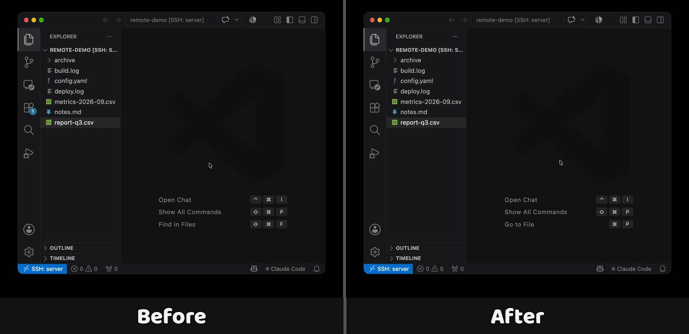

# Download All

[](https://github.com/silasjak/vscode-download-all/actions/workflows/ci.yml)

Download every selected file and folder from a remote VS Code workspace with **one** destination prompt instead of one dialog per item.



## Install

Search for **Download All** in the Extensions view, or from a terminal:

```bash
code --install-extension silasjak.download-all
```

## The problem

VS Code's built-in **Download…** in the Explorer context menu handles one item at a time: `FileDownload` loops over the selection and opens a save dialog for every single entry, sequentially — the next dialog only appears once the previous transfer has finished. Selecting twelve files means confirming twelve dialogs. Upstream requests for batching this have been in the backlog for years ([vscode-remote-release#5886](https://github.com/microsoft/vscode-remote-release/issues/5886), [#3020](https://github.com/microsoft/vscode-remote-release/issues/3020)).

## What this does

Select several files or folders in the Explorer → right-click → **Download All…** → pick a destination folder once → everything lands there.

## Settings

| Setting | Default | Description |
| --- | --- | --- |
| `downloadAll.onConflict` | `prompt` | What to do when a name already exists in the destination: `prompt`, `overwrite`, `skip` or `rename`. |
| `downloadAll.defaultDestination` | `""` | Local folder the dialog opens in, e.g. `~/Downloads`. The previous download's folder wins over this. |
| `downloadAll.concurrency` | `4` | Parallel transfers. Lower it on slow or unstable connections. |

## Development

```bash
npm install
npm run compile        # or: npm run watch
npm run package        # builds download-all-<version>.vsix
```

Install a local build with `code --install-extension download-all-*.vsix`, then reload. The extension runs in the local (UI) extension host — that is what makes the destination dialog a native, local folder picker.

## License

MIT
